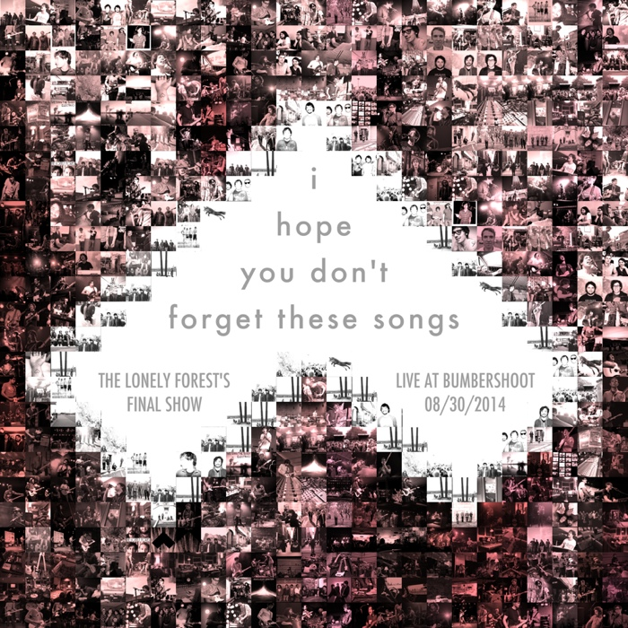

# The Lonely Forest – *I Hope You Don’t Forget These Songs* - Live at Bumbershoot 2014 [08/30/14]

**The Lonely Forest**  
**Bumbershoot Fountain Lawn Stage**  
**Seattle, WA**  
**August 30, 2014**

**Recording Details:**  
Zoom H4n Handy Recorder [Soundboard+Audience @ 24/48] > Logic Pro X > Audacity > dBPowerAmp

**Setlist:**
1. intro
2. They’re on to Something
3. Far Outer Banks
4. Two Pink Pills
5. Coyote
6. Left Hand Man
7. Centennial
8. Soil, Silt and Clay
9. Tunnels
10. Blackheart vs. Captain America
11. Let It Go
12. Turn Off This Song and Go Outside
13. I Don’t Want to Live There
14. We Sing in Time

**Upload Information:**  
Uploaded to wesingintime.com and fireworksordie.com on October 15, 2014

---

Well, this is it. The last Lonely Forest show, and consequently, my last Lonely Forest recording. Special thanks to Ryan Ricketts for his always-excellent board mixing. The show is fantastic, and the recording came out great. It was a very special day, and I’m glad that those who couldn’t make the trip out get to experience it second-hand.

I hope you’ll take some time to enjoy the full cover artwork—there are many photos from shows over the past years as well as old promo and studio session photos, many of which have never before seen the light of day. Huge thanks to Tony for digging these up, as well as everyone else who sent photos to include in the mosaic lottery. (And yeah, there are some repeats—you didn’t think I made this by hand, did you? There’s always an app for that!)

The Lonely Forest and their music have meant and will continue to mean a lot to me, and there’s no way I could have imagined just four years ago that I’d be able to call these guys my friends someday. So thank you John, Tony, Eric, and Braydn, for bringing these songs into the world, and for being all-around fantastic people. I look forward to what you’ll all do in the years to come.

**Mixed/mastered by**: fireworksordie  
**Website**: [fireworksordie.com](http://fireworksordie.com)  
**Contact**: [@fireworksordie](https://twitter.com/fireworksordie) / fireworksordie@gmail.com
