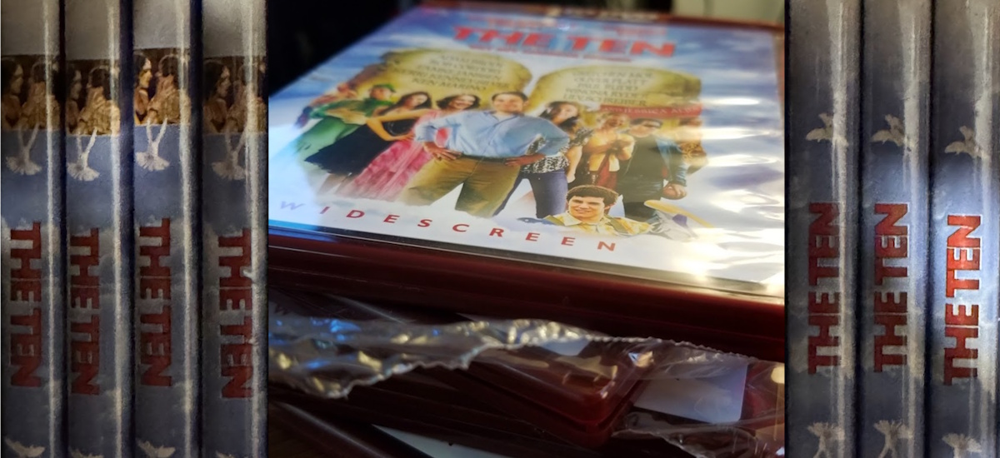

# THE TEN in 1080p
## Seven Years, Seven Discs, and the Stubborn Pursuit of Quality

I have this odd obsession with a movie called _THE TEN_, an absurdist comedy written and directed by David Wain, the genius behind _WET HOT AMERICAN SUMMER_ and one of the many members of _The State_. It's extremely silly and it holds a special place in my heart. The film takes the ten commandments and loosely interprets them through a series of ridiculous vignettes, with appearances by Paul Rudd, Justin Theroux, Rob Corddry, even Jessica Biel—a surprising amount of star power for such a strange project. It doesn't take itself seriously, and I adore it for that.

I have standards (sometimes known as *issues*) when it comes to video and audio quality that often get in the way of enjoying something outright. *THE TEN* was released in 2008, during a transitional period when Blu-ray and HD DVD were battling it out like VHS vs. Betamax. As we all know, HD DVD lost the war—nobody ever talks about HD DVD anymore (except me, I'm about to talk to about HD DVD a lot)—and Blu-ray became the standard for high definition. And while _THE TEN_ did get a brief HD DVD release in the U.S., high definition 1080p video was overkill for a lot of online video enjoyers back in 2008, and I've only been able to track down a 720p encode of the HD DVD. Surely I could find a Blu-ray copy?

The movie did eventually come out on Blu-ray, but only in a few regions in Europe. European releases use the PAL video format, which runs slightly faster (25 frames per second) than the NTSC standard used in the U.S. (23.97 frames per second). Depending how the studio converts their film, this often results in the movie's audio having a slightly higher pitch a shorter runtime. For many people, this might not be a problem, but I know how Paul Rudd is supposed to sound. To top it off, *THE TEN* makes use of many transitional title cards, and the regional Blu-rays have locally translated versions of that on-screen text. 

I was stuck with two options: a lower-quality, standard-definition version of the movie that was otherwise good, or a higher-resolution copy that ran too fast and had foreign text. And I settled for neither.

In 2018, after letting this frustration stew for a few years, I decided to take matters into my own hands. I bought an HD DVD player and a sealed copy of _The Ten_ on HD DVD off of eBay. The plan was to archive the disc and encode a proper 1080p version myself. Preservation! But after plugging the old Xbox 360 HD DVD drive into my PC, inserting the disc, and copying the disc contents to my PC for decryption, the process kept failing. I couldn’t figure out what was wrong—the disc was visually flawless, no scratches, nothing. After trying a few times, I accepted that I got a bad disc and I ordered another sealed copy. After waiting a week for it to arrive I was met with the same issue. Hmmm.

I did some heavy googling and I learned that HD DVDs are particularly susceptible to "disc rot"—especially from particular manufacturing plants. _The Ten_ was one of many HD DVDs manufactured with this flaw. I reached out to the eBay seller and worked out a deal to buy all of his remaining sealed copies of THE TEN. And when they arrived, every copy failed to read properly. I still own seven copies of *THE TEN* on HD DVD, and none of them work.

I was defeated, and I gave up. I resigned myself to living with these two imperfect versions of the movie on my media server, and I didn't want to watch either of them. But giving up on a project like this never clears my mental space. This was no longer just about having a good copy of a very dumb movie—it was about the principle of preservation, of restoring something obscure that no one else cared enough about to save.

Almost 7 years later, with some unexpected free time and a list of unfinished projects always haunting me, I decided to revisit the project with a new approach. The plan was ambitious: create a hybrid version splicing together elements from the European Blu-ray and the U.S. copy. I spent a day in DaVinci Resolve replacing the frames with German text cards with the corresponding frames from the U.S. copy, carefully matching the color and contrast. I did a deep dive on re-timing PAL video to NTSC, adjusting the frame rate of the Blu-ray to match the U.S. version so it ran at the correct speed without any noticeable glitches. This process took a few days of trial and error, but I ended up with a 1080p version of the movie at its original 23.97fps speed with English title cards that looked like they belonged. But after all that, there was one major problem: the audio.

The retimed Blu-ray didn't quite sync with the HD DVD audio. I couldn't for the life of me figure out why. I chalked it up to differences in exports for their respective formats. And after looking into retiming the audio like I did with the video... that was also out of the question. Speeding audio up raises the pitch and slowing it down lowers the pitch, but if you want to slow it down and maintain the pitch, you end up with artifacting—distortions and glitches that sound off to the human ear. I tried, and nothing sounded passable. It wouldn't have left me satisfied. Here I was, another solid week or so dedicated to finally getting this thing sorted, and despite all my efforts, I had hit another brick wall. Frustrated, I abandoned the project. Again.

A month or two later, at about one in the morning, I did a little more searching, just to check some places I hadn't looked, with low expectations. I was genuinely shocked: almost exactly a year prior, someone had uploaded _THE TEN_, ripped from a Blu-ray. An encoding I hadn’t seen before. But it looked like my white whale—23.97fps. Intrigued, I downloaded it and confirmed that its runtime matched the U.S. HD DVD version almost exactly. The bitrate was lower than I'd like, resulting in visual artifacting in the video, but the audio bitrate and format was up to my standards. On a whim, I layered the audio track over the video I had meticulously edited couple months earlier and hit play. Everything synchronized perfectly. Literally no adjustments were needed—the stars had aligned. I lost my fucking mind.

At two in the morning, I sat there in disbelief. After seven years of searching, giving up, experimenting, and giving up, I had finally built the perfect version of _THE TEN_ out of parts: high bitrate, proper frame rate, accurate audio, and English title cards. I spent the next couple hours transcribing English subtitles by hand for a segment set in Mexico to perfectly match the original HD DVD's burned-in subtitles. I was so close to the end I could taste it. It was the culmination of hours of obsessive work and a little bit of luck. At about 5 AM I texted my friends that it was done. Finally done.

This project was just as absurd and silly as the movie itself—a true labor of love. I have felt a bit crazy putting this much effort into preserving a better quality copy of movie that many people will never hear of, let alone watch. But it's a testament—*an old testament*—to my passion for media preservation, attention to detail, and a stubborn but ingrained refusal to settle for "good enough." _THE TEN_ may not mean much to the world, but to me, it’s perfect.